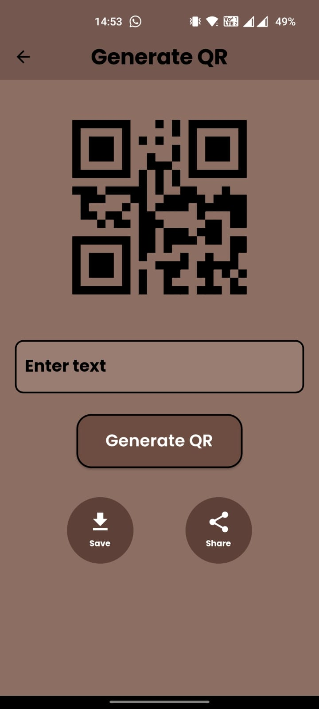

# QR Generator & Scanner

A simple use case approach to scan and generate QR codes using Flutter & Dart


## Getting started
```bash
flutter pub get
```

## Features
1. Switch Camera 
2. Toggle Torch
3. Share 
4. Copy to Clipboard

## Results
<p>


</p>
<p>


</p>

## Refernces
1. Google Fonts <br>
2. QR Flutter <br>
3. Mobile Scanner <br>
4. Flutter Launcher Icons  <br>